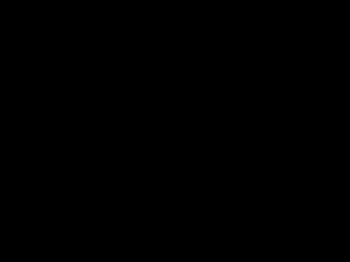

## Resize-Image-Interpolation
How image resize function working ?
## Introduce 
* Resize image in interpolation 
* Result comparing between code from scratch with opencv package  mode = INTER_NEAREST and mode = INTER_LINEAR

## Comparison
New Dimention = 0.7 * Old Dimention
* Original Image

 

Original Image

 
</img>
</img>
</img>
</img>

* BILINEAR INTERPOLATION (Orgin-Resized)

 
</img>
</img>
</img>
</img>

* DIFF NEAREST NEIGHBOR <-> OPENCV (Color-Gray)

 
</img>
</img>

* DIFF LINEAR <-> OPENCV (Color-Gray )

 
</img>
</img>

